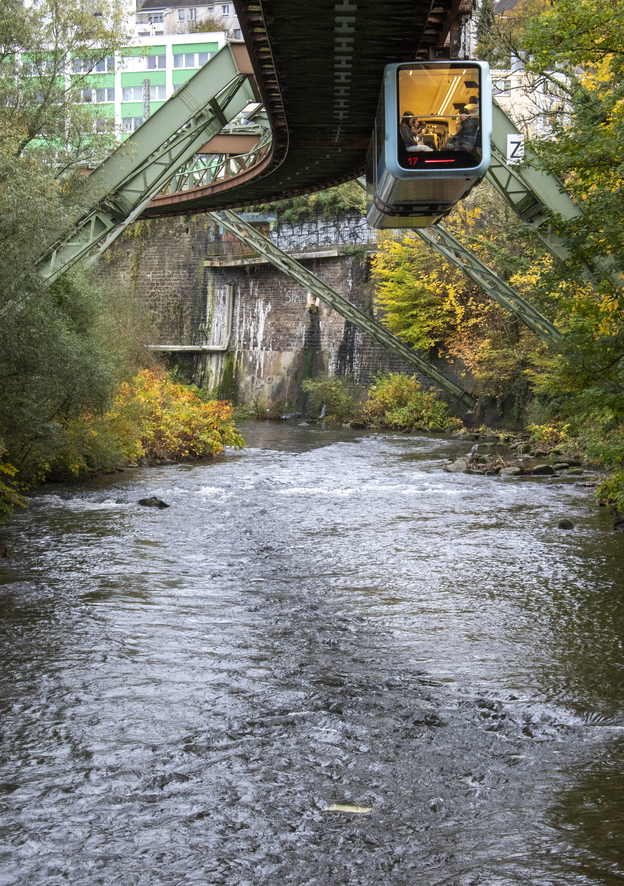
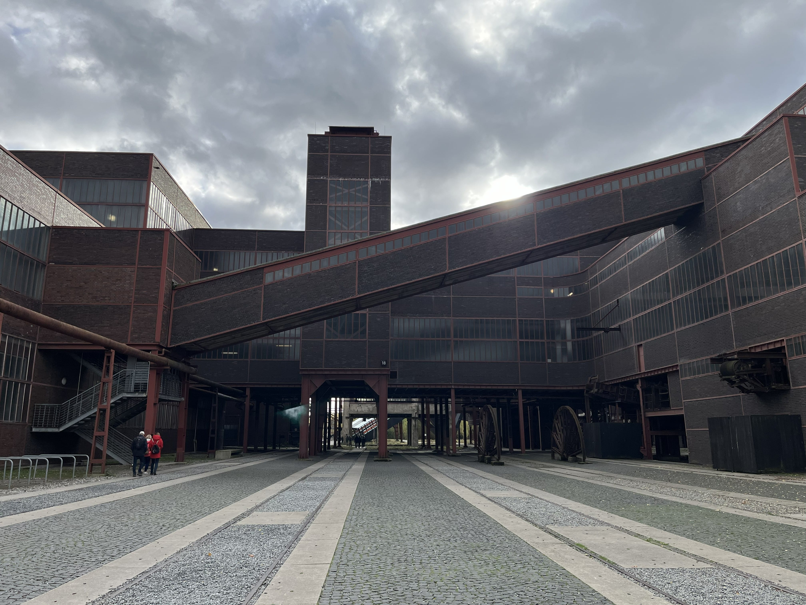
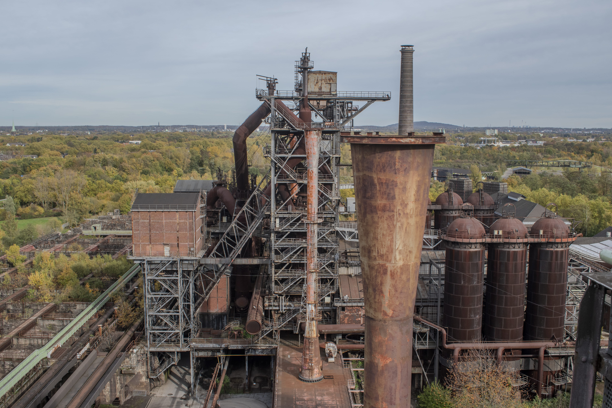
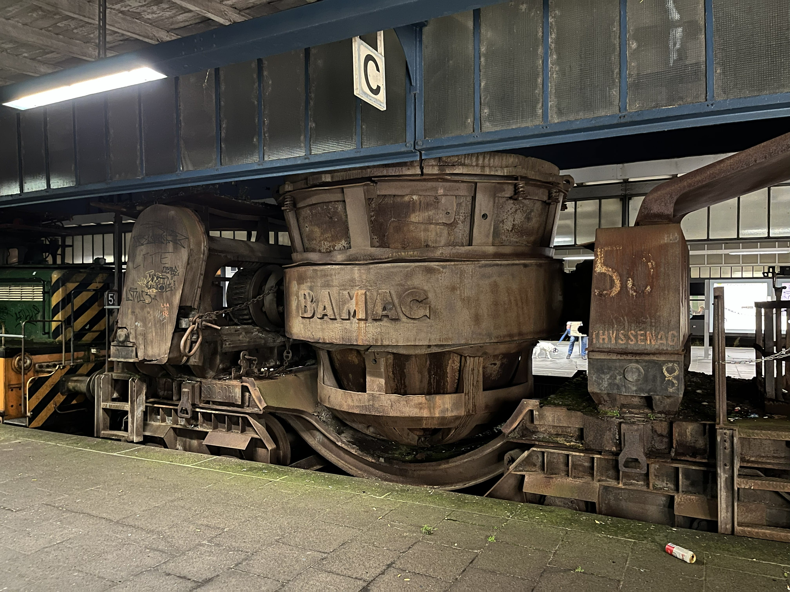
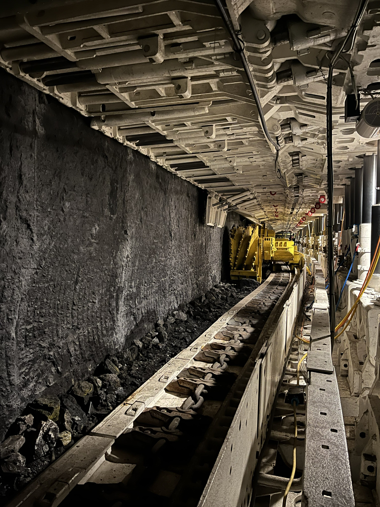

In October 2025, thanks to some of my own research and the [Infrastructure Club Travel Guide](https://infrastructureclub.org/travel_guide/) I decided to go on an infrastructure tour of the North Rhine-Westphalia region of Germany!

I chose this area as it's pretty easy to get to by train from the UK - and it has some amazing places that have been preserved that you can't find here. Plus, the D-Ticket is such amazing value and meant I could travel around very cheaply.

I visited the following places - and I share a full itinerary and map at the end of the post. 

**Tagebau Hambach Aussichtspunkt - Terra Nova 1** - the largest open cast lignite (coal) mine in Europe. I genuinely have never seen anything like this, the scale is incomprehensible and photos don't so it justice.

**Wuppertal** - the Schwebebahn - I spent all day going back and forth!

**Zollverein** - a preserved mine complex

**Landschaftspark Duisburg-Nord** - a preserved ironworks - really quite incredible, going up the blast furnace was a highlight of the trip.

**Oberhausen Hbf** - for the museum on the platforms

**Deutsches Bergbau-Museum Bochum** - The German Mining Museum

You can find more photos on my [photography website](https://wills.photography/gallery/cs-ys-uMgeoJSdPCGQgR2qcA).

<iframe src="https://www.google.com/maps/d/embed?mid=1wn9oIuBQdS1mLu4Ixc86NQTO-jjuNuQ&ehbc=2E312F&noprof=1" width="800" height="480"></iframe>

My itinerary infrastructure-wise was as follows:  
- Get a local train to London, using a CIV ticket  
- Stay overnight at the London Kings Cross Premier Inn Hub hotel  
- Get the Eurostar from St Pancras to Brussels-Midi  
- Get the DB ICE from Brussels-Midi to Koeln Hbf - there was a 20 min connection time between the trains, but this was totally fine. I was able to get a hot meal from the restaurant on this train too!  
- Stay one night at the Ibis Koeln Am Dom - it's literally part of the train station, so is very convenient!
- Visit Aussichtspunkt - Terra Nova 1 for viewing the biggest open cast lignite mine in Europe.
    - I took a local train to Horrem and then a local bus (941) to Elsdorf. From there, I could walk for about 20 mins to the viewing point.
- After getting back to Koeln, I took a Regional Express train to Essen Hbf - the D-Ticket is valid on these, and not the ICE trains that make the same journey. It's really not much longer on the local train anyway.
- I stayed 5 nights in the Premier Inn right next to the train station - also very convenient for getting around. Essen was a good base for going to all the other places I wanted to see.
- I spent the day in Wuppertal, going back and forth on the Schwebebahn! 
    - I got here via local train, the S9. I had to make my way back a different way because of disruption, but thanks to the DB Navigator app I was able to reroute myself easily.
- I went to Zollverein, exploring the grounds there all day, and also visiting the Rhur Museum whilst I was there. It is very easy to spend a whole day here, wandering around and looking at all the different component parts of the coal mine and coking plant.
    - It's direct from Essen Hbf on the 107 tram. 
- The next day I went to Landschaftspark Duisburg-Nord. An incredible place - given you can go all the way up the top of the blast furnace! I also spent a whole day here wandering and exploring.
    - I took a local train from Essen Hbf to Duisburg Hbf and then a tram to Landschaftspark Duisburg-Nord.
- On the same day, I also went to Oberhausen Hbf, where they have a couple of platforms out of use and used as a museum.
- I then, the next day, went to Deutsches Bergbau-Museum Bochum - The German Mining Museum. This is really cool as they have a replica mine underground that you can explore at your own pace!
    - You can take a Regional Express (11) from Essen Hbf to Bochum Hbf, and then the underground service to the museum.
- To return home, I took a Eurostar (Red, ex. Thalys) service from Essen all the way to Brussels. I wanted to try out a different service on the way back - but in the future I'd just get a DB ICE service, they run the same route and are a lot cheaper.
- From Brussels I then took Eurostar (Blue) back to London.

This kept me very busy for a week!
