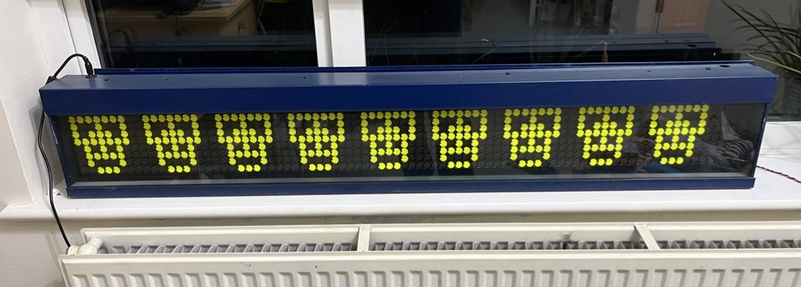

I, and others, have been working on a replacement controller for Hannover flipdot displays. 

I haven't had much success at getting the newer version (with Ethernet support) to work yet - but wanted to document that this work is taking place.

However, the old version, based on [damow's work](https://damow.net/fun-with-flip-dot-displays/) does work well! And has been working well for years.

And a video of text scrolling:



You can see the work in progress code and PCB designs here: [https://github.com/willfurnell/esp32-flipdot-controller](https://github.com/willfurnell/esp32-flipdot-controller)

Here's a video when the code wasn't working quite right... solved in a later revison. It's hard!

