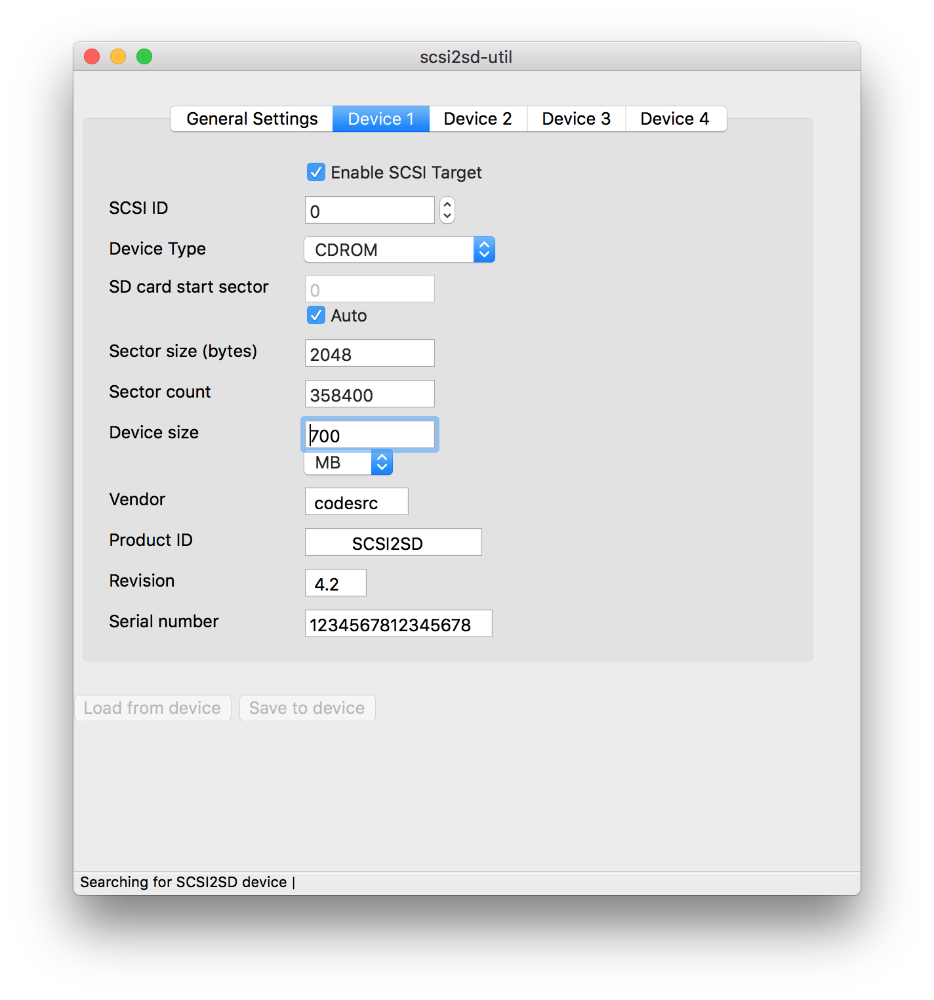

I got a SCSI2SD v5 board the other day for a Macintosh Quadra 700 as the original hard drive had finally died. 

Unfortunately this machine (at the moment) has basically no I/O - the floppy drive is not functioning properly and I do have a SCSI CD drive, but not SCSI1. 

So... I needed a way to install Mac OS 8 without using the floppy or CD drive. 

I decided to use the SD card as both the HDD and the installation media. To start with I hooked up the blank SD card to my modern computer, downloaded a Mac OS 8.1 ISO (https://winworldpc.com/download/7724D496-62C2-11E6-977E-525400B25447) and wrote the ISO to the SD card, like I've done before with USB sticks. 
eg ``` diskutil list # to get SD card identifier dd if=MacOS8_1.iso of=/dev/[SD card disk identifier] ``` 

Then it's easy as plugging in the SD card to SCSI2SD and connecting the board to the computer. 

Using scsi2sd-util you can then set up this part of the SD card to be presented as a CDROM device 
 
and set up other 'devices' as HDD's (as long as they are less than or equal to 1GB). You can boot from the 'CDROM' and install Mac OS to a 'device'.